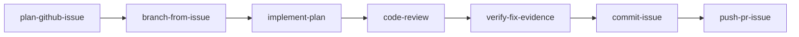

# Agent Skills — Issue-to-PR Pipeline

Shared Cursor Agent skills for taking a GitHub issue from plan through verified changes to a pushed branch and open PR.

## Layout

```
skills/                     # canonical source of truth (edit here)
.cursor/skills -> ../skills # Cursor discovery
.agents/skills -> ../skills # open standard / npx skills add
```

Symlinks are committed to git. Edit skill files under `skills/` only — the symlinked directories resolve to the same content.

If you also have copies in `~/.cursor/skills/`, the repo bundle is the team source of truth. Teammates who clone the repo get the skills automatically; no personal install step required.

## Pipeline

`ship-issue` orchestrates the full workflow. The other skills are invoked automatically at each stage.

| Skill | Stage | What it does |
|---|---|---|
| `ship-issue` | All | Orchestrates the full pipeline with approval gates |
| `plan-github-issue` | 1 | Fetches the issue, explores the repo, produces a plan |
| `branch-from-issue` | 3 | Creates a branch off `origin/qa` named after the issue |
| `implement-plan` | 4 | Implements the plan, runs targeted tests |
| `code-review` | 6 | Reviews the diff (StandardRB, Brakeman, RSpec) |
| `verify-fix-evidence` | 7 | Captures before/after screenshots and action GIFs per AC |
| `commit-issue` | 9 | Commits with Conventional Commits messages |
| `push-pr-issue` | 10 | Pushes the branch and opens a PR |



## Prerequisites

Install these before running `ship #N`:

| Tool | Required | Install |
|---|---|---|
| **Cursor** with Agent mode | Yes | — |
| **`gh` CLI** (authenticated) | Yes | `brew install gh && gh auth login` |
| **Rails dev env** (bundle, RSpec) | Yes | `bundle install` |
| **Local app running** | For UI fixes | `bin/rails server` (default port 3000) |
| **`gifski` or `ffmpeg`** | Optional | `brew install gifski` or `brew install ffmpeg` |
| **Browser MCP** (`cursor-ide-browser`) | For UI evidence | Enabled in Cursor MCP settings |

`ship-issue` runs a preflight check at startup. Hard stops (`gh` auth, `origin/qa`) block the pipeline immediately. Warnings (missing GIF tools, dev server down) are noted but do not block — you may hit issues later at Stage 7 if the fix is UI-related.

## Usage

In Cursor Agent chat:

```
ship #123
ship #456 --auto
/ship-issue
@ship-issue
```

- **Interactive mode** (default): pauses for plan approval, diff review, commit message, and push approval.
- **Autonomous mode** (`--auto`): skips approval gates; safety stops (failing tests, code review blockers, verification gaps) still apply.

## Repo conventions

These assumptions are baked into the skills:

- **Base branch:** `origin/qa`
- **Branch naming:** `<prefix>/<issue-number>-<slug>` (e.g. `feat/1234-judge-dashboard-fix`)
  - Prefix from issue labels: `feat/`, `fix/`, `chore/`
- **Commits:** Conventional Commits — `feat(1234): add judge dashboard filter`
- **Tests:** RSpec (`bundle exec rspec`)
- **Linting:** StandardRB (`bundle exec standardrb`)
- **Security:** Brakeman (`bin/brakeman -q --no-pager`)

## Seed accounts (UI verification)

For role-specific screenshot evidence in `verify-fix-evidence`:

| Role | Email | Password |
|---|---|---|
| Student | `student@student.com` | same as email |
| Mentor | `mentor@mentor.com` | same as email |
| Chapter ambassador | `chapter-ambassador@chapter-ambassador.com` | same as email |
| Judge | `judge@judge.com` | same as email |
| Admin | `admin@admin.com` | same as email |

## Updating skills

1. Edit the relevant `skills/<skill-name>/SKILL.md`.
2. Commit and push — teammates get updates on next pull.
3. No restart or reinstall needed; Cursor discovers skills on startup.
