# Ship Issue

Run the full pipeline that takes a GitHub issue from a plan to verified, evidence-backed changes on a fresh branch, ending with a pushed branch and PR URL. This skill does not re-implement any stage; it delegates to dedicated child skills and enforces the approval gates between them (unless running in autonomous `--auto` mode).

## Pipeline

```mermaid
flowchart LR
  Sync["checkout qa + pull"] --> Plan["plan-github-issue"]
  Plan --> G2{"--auto?"}
  G2 -->|no| ApprovePlan["user approves plan"]
  G2 -->|yes| Branch
  ApprovePlan --> Branch["branch-from-issue"]
  Branch --> Implement["implement-plan"] --> G5{"--auto?"}
  G5 -->|no| ApproveDiff["user approves diff"]
  G5 -->|yes| Review
  ApproveDiff --> Review["code-review (safety stop kept)"]
  Review --> Verify["verify-fix-evidence (safety stop kept)"]
  Verify --> Report["final report + ledger"]
  Report --> Commit["commit-issue (gate skipped in --auto)"]
  Commit --> PushPR["push-pr-issue (gate skipped in --auto)"]
  PushPR --> Done["done"]
```



## Inputs

Parse from the user's message:

- **Issue number** (required) - accept `#123`, `123`, `GH-123`, or a full GitHub issue URL.
- **Repo** (optional) - if the user gives `owner/repo` or a GitHub URL, pass it through to the planning stage. Otherwise rely on the workspace's git remote.
- **Mode** (optional) - default `interactive`. Set to `autonomous` when the message contains `--auto`, `auto-ship #N`, "autonomously", "no gates", "no approvals", or "unattended".

If the issue number cannot be determined, ask once via AskQuestion before starting (even in autonomous mode).

In `autonomous` mode, the pipeline must run in **agent mode** the entire time (plan mode forbids non-markdown edits and non-readonly tools). If `--auto` is requested while plan mode is active, call `SwitchMode` to `agent` once up front and wait for user consent before proceeding; this is the only unavoidable human touch in an autonomous run.

## Assumptions

This pipeline is built for a **Ruby on Rails** repository that:

- Uses `origin/qa` as the base branch for feature work.
- Uses RSpec for tests, StandardRB for linting, and Brakeman for security scanning (Stage 6).
- Uses Cursor plan files (`## Affected code` sections) to attribute files to commits (Stage 9).

If your repo differs on any of these points, adapt the relevant stage instructions before running.

## Autonomous mode

When **Mode** is `autonomous`, skip the approval gates below and continue through the pipeline without `AskQuestion` prompts at those points. Carry the signal **"this skill is running in autonomous mode"** into Stages 9 and 10 so `commit-issue` and `push-pr-issue` skip their internal approval gates.

| Gate | Interactive | Autonomous (`--auto`) |
|---|---|---|
| Resume confirmation | `AskQuestion` before resuming | Auto-select resume point; log choice to ledger |
| Stage 2: Plan approval | Wait for user to accept/revise plan | Treat `CreatePlan` output as auto-approved; continue to Stage 3 |
| Stage 5: Diff approval | Wait for user to confirm continue | Log changed files + test outcomes to ledger; continue |
| Stage 9: Commit message (`commit-issue` Step 5) | `AskQuestion` per todo | Skip approval; commit drafted message |
| Stage 10: Push approval (`push-pr-issue` Step 3) | `AskQuestion` before push | Skip approval; push and create PR |

**Safety stops that still apply in autonomous mode** (these are not gates — the pipeline stops and surfaces the failure):

- Dirty working tree or non-fast-forward `qa` at Stage 0 sync (no auto-stash or workaround)
- Failing tests after the retry budget (`implement-plan` Step 5)
- Critical or Important findings from `code-review` (Stage 6)
- Verification evidence gaps (`verify-fix-evidence`, Stage 7)
- Secret-file staging confirmation (`commit-issue` Step 6)
- Dirty tree, branch-name mismatch, no commits, push rejection, or PR creation failure (`push-pr-issue`)
- Any child-skill blocker (dirty tree at branch creation, pre-commit hook failure, etc.)
- Loop-back to plan when the plan itself is wrong (re-run Stage 1; in autonomous mode, Stage 2 auto-approves the revised plan)

## Stage 0: Sync

**Before the preflight checklist and before Stage 1**, verify the working tree is clean, then land on a fully-synced `qa`:

```bash
git status --porcelain                        # non-empty -> hard-stop (do NOT carry dirt to qa)
git checkout qa 2>/dev/null || git checkout -b qa origin/qa   # handles no-local-qa
git pull --ff-only origin qa                  # non-fast-forward -> hard-stop (no merge commits)
```

**Hard-stop conditions (stop immediately, surface the error, do not proceed):**

- `git status --porcelain` is non-empty — do not rely on `git checkout` to catch this; it silently carries uncommitted changes onto `qa` when there are no conflicts.
- `git pull --ff-only` fails — local `qa` has diverged from `origin/qa`; do not create an accidental merge commit.
- `origin/qa` does not exist — stop and ask the user which base branch to use.

**Autonomous mode:** a dirty tree or a non-fast-forward `qa` is a **hard-stop** in autonomous mode. Do not auto-stash or attempt any workaround.

## Preflight

Run this checklist **before Stage 1**. Do not start the pipeline until all hard stops pass.

### 1. Child skills on disk

Verify the **seven** child skills exist. Check for these `SKILL.md` files (in `skills/<name>/SKILL.md`, `~/.cursor/skills/<name>/SKILL.md`, or the workspace `.cursor/skills/<name>/SKILL.md`):

- `plan-github-issue`
- `branch-from-issue`
- `implement-plan`
- `code-review`
- `verify-fix-evidence`
- `commit-issue`
- `push-pr-issue`

If any are missing, stop immediately and tell the user which skill files were not found. Do not attempt to inline the missing skill's logic.

### 2. Machine readiness

Run these checks and classify each result as **hard stop** (stop pipeline) or **warning** (note and continue):

```bash
# Hard stops
gh auth status
git ls-remote --heads origin qa

# Warnings (needed later in the pipeline)
command -v bundle && bundle check
command -v gifski
command -v ffmpeg
```

| Check | Classification | When needed | If missing |
|---|---|---|---|
| `gh auth status` succeeds | Hard stop | Stages 1, 3, 9, 10 | Stop. Tell user to run `brew install gh && gh auth login`. |
| `origin/qa` exists | Hard stop | Stage 3 | Stop. Ask which base branch to use. |
| `bundle` available and `bundle check` passes | Warning | Stages 4, 6 | Note in readiness summary; tests/lint may fail later. |
| `gifski` or `ffmpeg` available | Warning | Stage 7 (action GIFs) | Note in readiness summary; Stage 7 falls back to frame sequence. |
| Browser MCP (`cursor-ide-browser`) available | Warning | Stage 7 (UI evidence) | Note in readiness summary; UI verification will fail if the diff touches views/JS/controllers. |
| Local dev server reachable | Warning | Stage 7 (UI evidence) | Note in readiness summary; try `curl -s -o /dev/null -w "%{http_code}" http://localhost:3000` or the app's configured port. |

**Browser MCP check:** attempt to list MCP tools or confirm `cursor-ide-browser` is configured for this workspace. If unavailable, record a warning — do not hard-stop unless the user explicitly requires UI verification for this run.

**Dev server check:** if `curl` to the default local port returns a non-2xx/3xx response, record a warning. Do not hard-stop; Stage 7 may still be skippable for non-UI changes.

### 3. Readiness summary

After both checks, emit a short summary before proceeding:

```markdown
## Ship preflight: issue #<N>

**Skills:** 7/7 present
**Hard stops:** gh ✅ | origin/qa ✅
**Warnings:** bundle ✅ | gifski/ffmpeg ⚠️ (frames only) | browser MCP ✅ | dev server ⚠️ (not running)
```

If any hard stop failed, stop the pipeline and surface the fix instructions. If only warnings remain, continue to the Resume section and note which stages may be affected.

## Resume

Before running Stage 1, check whether a previous run exists for this issue and offer to resume from where it stopped.

Run these checks in order:

```bash
# 1. Plan file
ls ~/.cursor/plans/ | grep "^.*-<N>[^0-9]"

# 2. Branch
git branch --list "*/<N>-*"

# 3. Commits ahead of origin/qa on that branch
git log origin/qa..HEAD --oneline 2>/dev/null

# 4. Evidence directory
ls tmp/issue-<N>-* 2>/dev/null

# 5. Ship ledger
ls tmp/issue-<N>-*/ship-ledger.md 2>/dev/null
```

Map the detected state to a resume point:

| State detected | Resume at |
|---|---|
| No prior state found | Stage 1 (fresh run) |
| Plan file exists, branch not yet created | Stage 2 (approve existing plan) |
| Branch exists, no commits ahead of `origin/qa` | Stage 3 already done; skip to Stage 4 |
| Commits ahead of `origin/qa`, evidence dir missing | Stage 7 (verify) |
| Evidence dir exists, ledger shows all AC checked | Stage 8 (final report) |
| Ledger exists, all commits made, no PR yet | Stage 10 (push + PR) |

If the ledger (`ship-ledger.md`) exists, read it: it records the exact last completed stage and any gaps. Prefer the ledger over the heuristics above when both are available.

**Interactive mode:** Present the detected state and proposed resume point via `AskQuestion` before proceeding. Do not auto-resume without user confirmation.

If the user opts for a fresh run despite prior state: delete any existing ship ledger (`rm tmp/issue-<N>-<fix-slug>/ship-ledger.md`) and start at Stage 1. Do not delete evidence directories or commits.

**Autonomous mode:** Auto-select the resume point (prefer `ship-ledger.md` over the heuristics table when both are available). Log the detected state and chosen resume point to the ledger (create a minimal ledger entry if one does not exist yet) and proceed without `AskQuestion`. Always resume from the detected point — do not start a fresh run unless the user explicitly requested one in the same message.

## Ship Ledger

Every stage writes one entry to `tmp/issue-<N>-<fix-slug>/ship-ledger.md`. The ledger serves two purposes:

1. **Resume state**: the Resume section reads it to find the last completed stage.
2. **PR body source**: Stage 10 passes it to `push-pr-issue` as the PR description.

Create the file on first write (typically when the evidence directory is created at the start of Stage 7; for runs that skip Stage 7 entirely, create it in Stage 8). Append to it — never overwrite previous entries.

### Ledger template

```markdown
# Ship ledger: issue #<N> — <title>

- **Branch:** `<prefix>/<N>-<slug>`
- **Plan:** `~/.cursor/plans/<file>.plan.md`
- **Base:** `origin/qa`

## Stages

| Stage | Status | Timestamp |
|---|---|---|
| 1 Plan | ✅ complete | <ISO timestamp> |
| 2 Plan-approval | ✅ approved | <ISO timestamp> |
| 3 Branch | ✅ complete | <ISO timestamp> |
| 4 Implement | ✅ complete | <ISO timestamp> |
| 5 Diff-approval | ✅ approved | <ISO timestamp> |
| 6 Code review | ✅ complete — Critical 0 / Important 0 / Suggestions N / Nits N | <ISO timestamp> |
| 7 Verify | ✅ complete — N before/after pairs, N action GIFs | <ISO timestamp> |
| 8 Final report | ✅ complete | <ISO timestamp> |
| 9 Commit | ✅ complete — <short-sha list> | <ISO timestamp> |
| 10 Push + PR | ✅ complete | <ISO timestamp> |

## Summary

<1-3 sentences on what the fix does>

## Acceptance criteria

- [x] AC1: <text> — [before](01-...-before.png) / [after](01-...-after.png)
- [x] AC2: <text> — [before](02-...-before.png) / [after](02-...-after.png) + [action GIF](02-...-action.gif)
- [x] AC3: <text> — re-ran `spec/foo_spec.rb` (passed)

## Tests

- `spec/foo_spec.rb` — passed (N examples)

## Code review

- Critical: 0
- Important: 0
- Suggestions: N
- Nits: N

## Files changed

<count> files — `<list of changed file paths, one per line>`

## Commits

- `<sha>`: `<subject>`
```

When any stage is skipped, record it as `⏭ skipped — <path-based reason>` in the Stages table.

When the pipeline stops on a blocker, record the affected stage as `❌ blocked — <blocker summary>` and leave subsequent stages blank.

## Workflow

Copy this checklist and track progress as you go:

```
- [ ] Stage 0: Sync — checkout qa + git pull origin qa
- [ ] Stage 1: Plan (delegate to plan-github-issue)
- [ ] Stage 2: Plan-approval gate
- [ ] Stage 3: Branch (delegate to branch-from-issue)
- [ ] Stage 4: Implement (delegate to implement-plan)
- [ ] Stage 5: Diff-review gate
- [ ] Stage 6: Code review (delegate to code-review)
- [ ] Stage 7: Verify (delegate to verify-fix-evidence, or skip with reason)
- [ ] Stage 8: Final report + ledger
- [ ] Stage 9: Commit (delegate to commit-issue)
- [ ] Stage 10: Push + PR (delegate to push-pr-issue)
```

### Stage 1: Plan

Apply the `plan-github-issue` skill end to end with the parsed issue number (and repo if given). The deliverable is a Cursor plan file produced via `CreatePlan`. Do not pre-empt or shortcut that skill's workflow.

Write to the ledger: `| 1 Plan | ✅ complete | <timestamp> |`

### Stage 2: Plan-approval gate

**Interactive mode:** Stop. Cursor's plan UI is the approval surface; the user either accepts the plan or asks for revisions. If they request changes, loop back to Stage 1 (re-run the planning skill on the same issue) before continuing.

**Autonomous mode:** Treat the `CreatePlan` output as auto-approved and continue immediately to Stage 3. The plan UI may still render; do not block on it. If a later stage reveals the plan is wrong, loop back to Stage 1 and auto-approve the revised plan here.

Write to the ledger: `| 2 Plan-approval | ✅ approved | <timestamp> |` (in autonomous mode, append ` — auto-approved` to the status text)

### Stage 3: Branch

Once the plan is approved, apply the `branch-from-issue` skill with the same issue number. It creates and checks out a new branch off `origin/qa` named `<prefix>/<issue-number>-<slug>` (e.g. `feat/1111-judge-dashboard-crashes`). If that skill stops with a blocker (dirty tree, missing `origin/qa`, duplicate branch name), surface the blocker and stop the pipeline - do not start editing on the wrong branch.

Write to the ledger: `| 3 Branch | ✅ complete | <timestamp> |`

### Stage 4: Implement

Once the branch is checked out, apply the `implement-plan` skill against the plan file produced in Stage 1. It edits files, runs targeted tests, and stops before any commit.

Write to the ledger: `| 4 Implement | ✅ complete | <timestamp> |`

### Stage 5: Diff-review gate

**Interactive mode:** Stop after `implement-plan` reports. Surface the changed files and test outcomes. Wait for the user to confirm "continue" (or equivalent) before moving on. If the user wants tweaks, address them within the plan's scope and re-run targeted tests; do not silently expand scope.

**Autonomous mode:** After `implement-plan` reports, log the changed files and test outcomes to the ledger and continue to Stage 6 without waiting.

Write to the ledger: `| 5 Diff-approval | ✅ approved | <timestamp> |` (in autonomous mode, append ` — auto-approved` to the status text)

### Stage 6: Code review

Apply the `code-review` skill against the staged/unstaged diff produced in Stage 4. Deliver its severity-labeled report. If `Critical` or `Important` findings appear, stop the pipeline and let the user decide whether to fix them or proceed.

**Do not re-run the specs implement-plan already ran in Stage 4.** Instruct `code-review` to:

- Run only static checks (`bundle exec standardrb`, `bin/brakeman -q --no-pager` when the diff touches auth, redirects, raw SQL, file uploads, deserialization, or `send`/`constantize` on user input).
- Run only the specs that Stage 4 did not cover (e.g. policy specs, request specs touching changed controllers — when not already in the Stage 4 set).

This keeps the review focused and avoids confusing reports from two test runs of the same files.

Write to the ledger: `| 6 Code review | ✅ complete — Critical N / Important N / Suggestions N / Nits N | <timestamp> |`

### Stage 7: Verify

Apply the `verify-fix-evidence` skill. It builds an AC checklist from the plan, maps each static UI AC item to a before/after Chromium screenshot pair, each action-based UI AC item to a before/after pair **plus an animated GIF**, and each non-UI AC item to a test. It captures all evidence into `tmp/issue-<N>-<fix-slug>/` and re-runs the modified test files.

For every UI-visible AC item (button appears, page renders, redirect fires, modal closes, copy changes), the skill **must** produce a matched before/after pair:
- **Before:** captured via the `cursor-ide-browser` MCP after stashing the in-progress fix against `origin/qa`.
- **After:** captured with the fix restored on the working branch.

For every **action-based** AC item (click feedback, redirect after submit, modal opens/closes, animation, drag/drop, form submission flow), the skill **must also** produce an animated GIF stitched from real captured frames of the action.

This stage is **complete only when every AC item in the checklist is checked**, every UI-visible AC item has both a `before` and an `after` screenshot, and every action-based AC item additionally has an action GIF. If any AC item is unchecked, any UI AC item is missing one of its screenshot pair, or any action-based AC item is missing its GIF, stop the pipeline and surface the gaps; do not proceed to Stage 8 with partial verification.

You may skip this stage entirely only when **all** of the following are true (verify with `git diff --name-only origin/qa...HEAD`):

- No files changed under `app/views/`, `app/javascript/`, `app/components/`, or `app/mailers/`.
- No files changed under `app/controllers/`.
- No new routes added in `config/routes.rb` (an unchanged or trimmed routes file is fine; new entries are not).

If any of those conditions fails, run `verify-fix-evidence`. Do not skip based on the agent's judgment about whether the change "feels" UI-relevant.

When the stage is legitimately skipped, say so explicitly in Stage 8 with the path-based reason (e.g. "skipped: diff touches only `app/models/` and `spec/models/`") and record `⏭ skipped — <reason>` in the ledger.

Write to the ledger Stages table and populate the `## Acceptance criteria` and `## Tests` sections.

### Stage 8: Final report

Emit a single short summary using the template below, then move on to Stage 9.

```markdown
## Shipped issue #<N>: <title>
- Plan: `~/.cursor/plans/<file>.plan.md`
- Branch: `<prefix>/<N>-<slug>` (off `origin/qa`)
- Files changed: <count>
- Tests: <outcome>
- Code review: <Critical N / Important N / Suggestions N / Nits N>
- Evidence: [`tmp/issue-<N>-<fix-slug>/`](tmp/issue-<N>-<fix-slug>/) (<N> before/after pairs, <N> action GIFs), or "skipped (no UI changes)"
- Next: commit (Stage 9), then push + PR (Stage 10)
```

Finalize the `## Summary`, `## Code review`, and `## Files changed` sections of the ledger, then write to the Stages table: `| 8 Final report | ✅ complete | <timestamp> |`

### Stage 9: Commit (one commit per plan todo)

Produce one commit per logical chunk in the plan. For each plan todo in the order it appears:

1. From the plan and the current diff, determine the files that belong to this todo (its `## Affected code` entries plus any test files added for it).
2. Stage exactly those files: `git add <files>`. Do not stage files belonging to other todos.
3. Apply the `commit-issue` skill. With pre-staged files present it commits only those (see `commit-issue` Step 6). The subject is `<type>(<N>): <chunk subject>` aligned with the todo. In autonomous mode, tell `commit-issue` that the caller is running in autonomous mode so it skips Step 5 approval.
4. **Interactive mode:** Get the user's approval inside `commit-issue` as usual, then move to the next todo. **Autonomous mode:** `commit-issue` commits the drafted message without `AskQuestion`, then move to the next todo.

**After all todos are committed**, run the following reconciliation check:

```bash
git diff --name-only origin/qa...HEAD
```

Compare the output against the union of all files staged across todos. If any file in the diff was **never staged by any todo**, stop immediately, list the orphan files, and ask the user how to attribute them. Do not collapse orphaned files into a catch-all commit to make progress.

If there is genuinely only one logical chunk (single-file fix, trivial change), one commit is fine — just run the loop once and then run the reconciliation check.

If `commit-issue` stops with a blocker (working tree unexpectedly clean, branch name does not match `<type>/<N>-<slug>`, pre-commit hook failure), surface the blocker and stop. Do not retry with `--no-verify` or invent a workaround. Do not collapse remaining todos into a single commit to "make progress".

Append each commit SHA and subject to the ledger's `## Commits` section. Write to the Stages table: `| 9 Commit | ✅ complete — <short-sha list> | <timestamp> |`

### Stage 10: Push + PR

Apply the `push-pr-issue` skill. Pass the path to the ship ledger (`tmp/issue-<N>-<fix-slug>/ship-ledger.md`) as the PR body source so the PR ships with the full AC checklist, evidence links, test results, and code review summary. In autonomous mode, tell `push-pr-issue` that the caller is running in autonomous mode so it skips Step 3 approval. **Interactive mode:** it must ask for explicit approval before pushing. Then push the branch and create a PR.

If `push-pr-issue` reports a blocker (dirty tree, missing auth, push rejection, or PR creation failure), surface the blocker and stop.

Write to the ledger: `| 10 Push + PR | ✅ complete | <timestamp> |`

Return the PR URL as a clickable Markdown link in your final user-facing output.

## Hard rules

- The only commit allowed in this pipeline is the one delegated to `commit-issue` in Stage 9. Never run `git add`, `git commit`, or `git commit --amend` directly from this skill, and never bypass `commit-issue` to commit elsewhere in the flow.
- Never run `git push` or `gh pr create` directly from this skill. Push/PR operations are allowed only by delegating Stage 10 to `push-pr-issue`.
- The only branch operation allowed is the one delegated to `branch-from-issue` in Stage 3 (creating and checking out a fresh branch off `origin/qa`). Never force-push, reset, rebase, or delete branches.
- **Interactive mode:** Honor the approval gates at Stages 2 and 5, the commit-message approval inside Stage 9, and the push approval inside Stage 10. Do not race ahead without the user's signal.
- **Autonomous mode:** Intentionally skip the approval gates at Stages 2, 5, 9 (`commit-issue` Step 5), and 10 (`push-pr-issue` Step 3). All safety-blocker rules still apply — if any child skill stops with a blocker, stop the pipeline and surface the blocker; do not invent a workaround.
- If any child skill stops with a blocker, stop the pipeline and surface the blocker; do not invent a workaround.
- Do not skip stages silently. If a stage does not apply, say so explicitly in the final report and record it in the ledger.
- Do not duplicate the child skills' logic here. Delegate fully to each named skill.
- **Loop back to plan when the plan is wrong.** If a later stage (implement, code review, verify) reveals that the plan itself is wrong — not just under-specified — stop and return to Stage 1. Re-run `plan-github-issue` with the new evidence and re-approve via Stage 2. Do not patch the implementation to compensate for a bad plan, and do not silently expand scope to cover what the plan missed.
