# Ship Issue

Run the full pipeline that takes a GitHub issue from a plan to verified, evidence-backed changes on a fresh branch, ending with a pushed branch and PR URL. This skill does not re-implement any stage; it delegates to dedicated child skills and enforces the approval gates between them (unless running in autonomous `--auto` mode).

Some stages run **inline** in the orchestrating (parent) agent, on whatever model the user picked to run `ship-issue`. The heavy stages are **delegated to worker subagents** on a cheaper/faster model so the expensive picked model is reserved for planning, gating, and code review. See the [Delegation & model matrix](#delegation--model-matrix).

## Pipeline

```mermaid
flowchart LR
  Sync["checkout qa + pull (inline)"] --> Plan["plan-github-issue (inline)"]
  Plan --> G2{"--auto?"}
  G2 -->|no| ApprovePlan["user approves plan"]
  G2 -->|yes| Branch
  ApprovePlan --> Branch["branch-from-issue (inline)"]
  Branch --> Before["3.5 capture-before (worker subagent · UI only)"]
  Before --> Implement["4 implement-plan (worker subagent · runs ALL tests)"]
  Implement --> G5{"--auto?"}
  G5 -->|no| ApproveDiff["user approves diff"]
  G5 -->|yes| Par
  ApproveDiff --> Par
  subgraph Par["Stages 6 + 7 in parallel"]
    Review["6 code-review (picked subagent · static-only)"]
    Verify["7 verify-after (worker subagent · no tests)"]
  end
  Par --> Report["8 final report + ledger (inline)"]
  Report --> Commit["9 commit-issue (inline)"]
  Commit --> PushPR["10 push-pr-issue (inline)"]
  PushPR --> Done["done"]
```



## Delegation & model matrix

| Stage | Skill | Runner | Model | Tests? |
|---|---|---|---|---|
| 0 Sync | — | parent (inline) | picked | no |
| Preflight / Resume / Ledger | — | parent (inline) | picked | no |
| 1 Plan | `plan-github-issue` | parent (inline) | picked | no |
| 2 Plan-approval gate | — | parent (inline) | picked | no |
| 3 Branch | `branch-from-issue` | parent (inline) | picked | no |
| 3.5 Capture-before | `verify-fix-evidence` (Steps 1–4) | **worker subagent** | **worker** | no |
| 4 Implement | `implement-plan` | **worker subagent** | **worker** | **yes — the only test stage** |
| 5 Diff-review gate | — | parent (inline) | picked | no |
| 6 Code review | `code-review` | **subagent** | **picked** (omit `model`) | no — static only |
| 7 Verify-after | `verify-fix-evidence` (Steps 5–7) | **worker subagent** | **worker** | no |
| 8 Final report | — | parent (inline) | picked | no |
| 9 Commit | `commit-issue` | parent (inline) | picked | no |
| 10 Push + PR | `push-pr-issue` | parent (inline) | picked | no |

**Rules baked into the matrix:**

- **"picked"** = the model the user launched `ship-issue` with. Stage 6 code-review inherits it by **omitting** the `model` argument on its `Task` call.
- **"worker"** = the resolved worker model (default `composer-2.5-fast`; see [Worker model resolution](#worker-model-resolution)).
- **Stage 1 stays inline** even though it delegates to `plan-github-issue`, because that skill uses `CreatePlan` and the plan UI is the Stage 2 approval surface — it must render in the user's main session, not inside a subagent.
- **Stage 3 branch, Stage 9 commit, and Stage 10 push are inline quick commands** — they are short and deterministic, so a subagent's spin-up cost is not worth it and they keep every git gate on the picked model.
- **Only Stage 4 runs tests.** Stage 6 and Stage 7 must not run `rspec`; they cite Stage 4's outcomes from the ledger. This keeps a single source of test truth and avoids two subagents hitting one test database during the parallel window.

## Subagent protocol

When a stage is delegated, launch it with the `Task` tool as follows.

- **`subagent_type`:** `generalPurpose` for every delegated stage.
- **`readonly`:** `false` for all of them — implement edits files; capture-before and verify-after need the `cursor-ide-browser` MCP (unavailable to readonly subagents); code-review runs `standardrb`/`brakeman`.
- **`model`:** set to the resolved worker model for Stages 3.5, 4, and 7. **Omit `model` for Stage 6** so it inherits the picked model.
- **`run_in_background`:** `false` (blocking) for the sequential subagents (3.5, then 4). `true` for Stages 6 and 7 — launch both in **one message with two `Task` calls**, then await both completions before Stage 8.

### Context block (every subagent prompt)

Subagents cannot see this conversation. Every `Task` prompt must be self-contained and include:

```
- Skill to read and follow: <absolute path to the child SKILL.md>
- Issue: #<N> (<repo if given>)
- Plan file: <absolute plan path>
- Branch: <prefix>/<N>-<slug>  (base origin/qa)
- Evidence dir: tmp/issue-<N>-<fix-slug>/
- AC map: tmp/issue-<N>-<fix-slug>/ac-map.md   (3.5 writes it; 4/6/7 read it if present)
- Mode: interactive | autonomous
- Scope overrides: <stage-specific, see below>
- Do NOT write the ship ledger. Return your result; the parent records it.
```

### Return contract (parent validates before continuing)

The parent reads each subagent's final message and confirms the expected shape before writing the ledger and proceeding. If a subagent returns malformed output, an empty result, or a blocker, the parent **stops** and surfaces it — never guesses or fabricates the missing result.

| Stage | Must return |
|---|---|
| 3.5 Capture-before | AC checklist, the `ac-map.md` it wrote, list of before-shot paths (or "no UI AC items — nothing captured") |
| 4 Implement | Changed files **grouped by the plan todo that produced them**, plus test commands run and their outcomes |
| 6 Code review | Severity-labeled findings (`Critical`/`Important`/`Suggestion`/`Nit`) per the `code-review` template |
| 7 Verify-after | AC checklist with each UI item mapped to a before/after pair (and action GIF where applicable), non-UI items citing Stage 4 test outcomes |

### Parent is the sole ledger writer

Subagents never touch `ship-ledger.md`. This avoids interleaved/corrupted writes when Stages 6 and 7 run in parallel and keeps resume state trustworthy. Subagents return structured results; the parent writes every ledger entry. Evidence files do not collide (3.5 writes before-shots + `ac-map.md`; 7 writes after-shots + GIFs), so subagents may write those directly.

## Worker model resolution

Resolve one worker model up front and reuse it for every worker subagent (Stages 3.5, 4, 7) across the whole run, including resume.

1. **Input override:** if the user's message includes a worker-model choice (e.g. `worker-model=gpt-5.6-terra-medium`), use it.
2. **Default:** otherwise `composer-2.5-fast`.
3. **Persist:** record it in the ledger header (`- **Worker model:** <slug>`) at first write so it is decided once and never re-derived.

**Unavailable-model handling (hard-stop-and-ask in BOTH modes):** if a `Task` launch fails because the worker model is unavailable, stop and `AskQuestion` once for a replacement (offer the other composer, the picked model, or Other). This is a required prompt **even in autonomous mode** — treat it like the plan-mode `SwitchMode` consent: an unavoidable human touch. Record the replacement in the ledger's `Worker model:` line and reuse it for all remaining worker stages. Never silently downgrade to a different model.

## Inputs

Parse from the user's message:

- **Issue number** (required) - accept `#123`, `123`, `GH-123`, or a full GitHub issue URL.
- **Repo** (optional) - if the user gives `owner/repo` or a GitHub URL, pass it through to the planning stage. Otherwise rely on the workspace's git remote.
- **Mode** (optional) - default `interactive`. Set to `autonomous` when the message contains `--auto`, `auto-ship #N`, "autonomously", "no gates", "no approvals", or "unattended".
- **Worker model** (optional) - e.g. `worker-model=<slug>`. Default `composer-2.5-fast`. See [Worker model resolution](#worker-model-resolution).

If the issue number cannot be determined, ask once via AskQuestion before starting (even in autonomous mode).

In `autonomous` mode, the pipeline must run in **agent mode** the entire time (plan mode forbids non-markdown edits and non-readonly tools). If `--auto` is requested while plan mode is active, call `SwitchMode` to `agent` once up front and wait for user consent before proceeding; this is one of two unavoidable human touches in an autonomous run (the other is an unavailable worker model).

## Assumptions

This pipeline is built for a **Ruby on Rails** repository that:

- Uses `origin/qa` as the base branch for feature work.
- Uses RSpec for tests, StandardRB for linting, and Brakeman for security scanning (Stage 6).
- Uses Cursor plan files (`## Affected code` sections) to attribute files to commits (Stage 9).

If your repo differs on any of these points, adapt the relevant stage instructions before running.

## Autonomous mode

When **Mode** is `autonomous`, skip the approval gates below and continue through the pipeline without `AskQuestion` prompts at those points. Carry the signal **"this skill is running in autonomous mode"** into the subagent context blocks and into Stages 9 and 10 so `commit-issue` and `push-pr-issue` skip their internal approval gates.

| Gate | Interactive | Autonomous (`--auto`) |
|---|---|---|
| Resume confirmation | `AskQuestion` before resuming | Auto-select resume point; log choice to ledger |
| Worker model unavailable | `AskQuestion` for a replacement | **`AskQuestion` for a replacement (still asks — hard stop)** |
| Stage 2: Plan approval | Wait for user to accept/revise plan | Treat `CreatePlan` output as auto-approved; continue to Stage 3 |
| Stage 5: Diff approval | Wait for user to confirm continue | Log changed files + test outcomes to ledger; continue |
| Stage 9: Commit message (`commit-issue` Step 5) | `AskQuestion` per todo | Skip approval; commit drafted message |
| Stage 10: Push approval (`push-pr-issue` Step 3) | `AskQuestion` before push | Skip approval; push and create PR |

**Safety stops that still apply in autonomous mode** (these are not gates — the pipeline stops and surfaces the failure):

- Dirty working tree or non-fast-forward `qa` at Stage 0 sync (no auto-stash or workaround)
- Worker model unavailable (stop and ask for a replacement — see [Worker model resolution](#worker-model-resolution))
- Any worker subagent returning malformed output, an empty result, or a blocker (see the return contract)
- Failing tests after the retry budget (`implement-plan` Step 5, Stage 4)
- Critical or Important findings from `code-review` (Stage 6)
- Verification evidence gaps (`verify-fix-evidence`, Stage 7)
- Secret-file staging confirmation (`commit-issue` Step 6)
- Dirty tree, branch-name mismatch, no commits, push rejection, or PR creation failure (`push-pr-issue`)
- Any child-skill blocker (dirty tree at branch creation, pre-commit hook failure, etc.)
- Loop-back to plan when the plan itself is wrong (re-run Stage 1; **also re-run Stage 3.5** if the revised plan's UI surface changed; in autonomous mode, Stage 2 auto-approves the revised plan)

## Stage 0: Sync

**Before the preflight checklist and before Stage 1**, verify the working tree is clean, then land on a fully-synced `qa`:

```bash
git status --porcelain                        # non-empty -> hard-stop (do NOT carry dirt to qa)
git checkout qa 2>/dev/null || git checkout -b qa origin/qa   # handles no-local-qa
git pull --ff-only origin qa                  # non-fast-forward -> hard-stop (no merge commits)
```

**Hard-stop conditions (stop immediately, surface the error, do not proceed):**

- `git status --porcelain` is non-empty — do not rely on `git checkout` to catch this; it silently carries uncommitted changes onto `qa` when there are no conflicts.
- `git pull --ff-only` fails — local `qa` has diverged from `origin/qa`; do not create an accidental merge commit.
- `origin/qa` does not exist — stop and ask the user which base branch to use.

**Autonomous mode:** a dirty tree or a non-fast-forward `qa` is a **hard-stop** in autonomous mode. Do not auto-stash or attempt any workaround.

## Preflight

Run this checklist **before Stage 1**. Do not start the pipeline until all hard stops pass.

### 1. Child skills on disk

Verify the **seven** child skills exist. Check for these `SKILL.md` files (in `skills/<name>/SKILL.md`, `~/.cursor/skills/<name>/SKILL.md`, or the workspace `.cursor/skills/<name>/SKILL.md`):

- `plan-github-issue`
- `branch-from-issue`
- `implement-plan`
- `code-review`
- `verify-fix-evidence`
- `commit-issue`
- `push-pr-issue`

If any are missing, stop immediately and tell the user which skill files were not found. Do not attempt to inline the missing skill's logic. **Record the resolved absolute path of each skill** — you will pass the relevant path into each subagent's context block.

### 2. Machine readiness

Run these checks and classify each result as **hard stop** (stop pipeline) or **warning** (note and continue):

```bash
# Hard stops
gh auth status
git ls-remote --heads origin qa

# Warnings (needed later in the pipeline)
command -v bundle && bundle check
command -v gifski
command -v ffmpeg
```

| Check | Classification | When needed | If missing |
|---|---|---|---|
| `gh auth status` succeeds | Hard stop | Stages 1, 3, 9, 10 | Stop. Tell user to run `brew install gh && gh auth login`. |
| `origin/qa` exists | Hard stop | Stage 3 | Stop. Ask which base branch to use. |
| `bundle` available and `bundle check` passes | Warning | Stages 4, 6 | Note in readiness summary; tests/lint may fail later. |
| `gifski` or `ffmpeg` available | Warning | Stages 3.5, 7 (action GIFs) | Note in readiness summary; those stages fall back to frame sequence. |
| Browser MCP (`cursor-ide-browser`) available | Warning | Stages 3.5, 7 (UI evidence) | Note in readiness summary; UI verification will fail if the diff touches views/JS/controllers. |
| Local dev server reachable | Warning | Stages 3.5, 7 (UI evidence) | Note in readiness summary; try `curl -s -o /dev/null -w "%{http_code}" http://localhost:3000` or the app's configured port. |

**Browser MCP check:** attempt to list MCP tools or confirm `cursor-ide-browser` is configured for this workspace. If unavailable, record a warning — do not hard-stop unless the user explicitly requires UI verification for this run. Note that worker subagents inherit the workspace's MCP access only when launched with `readonly: false`.

**Dev server check:** if `curl` to the default local port returns a non-2xx/3xx response, record a warning. Do not hard-stop; Stages 3.5/7 may still be skippable for non-UI changes. The dev server matters early now — Stage 3.5 captures the before-state off the clean `origin/qa` tree, so a running server is needed *before* implementation for UI issues.

### 3. Readiness summary

After both checks, emit a short summary before proceeding:

```markdown
## Ship preflight: issue #<N>

**Skills:** 7/7 present
**Worker model:** composer-2.5-fast
**Hard stops:** gh ✅ | origin/qa ✅
**Warnings:** bundle ✅ | gifski/ffmpeg ⚠️ (frames only) | browser MCP ✅ | dev server ⚠️ (not running)
```

If any hard stop failed, stop the pipeline and surface the fix instructions. If only warnings remain, continue to the Resume section and note which stages may be affected.

## Resume

Before running Stage 1, check whether a previous run exists for this issue and offer to resume from where it stopped.

Run these checks in order:

```bash
# 1. Plan file
ls ~/.cursor/plans/ | grep "^.*-<N>[^0-9]"

# 2. Branch
git branch --list "*/<N>-*"

# 3. Commits ahead of origin/qa on that branch
git log origin/qa..HEAD --oneline 2>/dev/null

# 4. Evidence directory
ls tmp/issue-<N>-* 2>/dev/null

# 5. Ship ledger
ls tmp/issue-<N>-*/ship-ledger.md 2>/dev/null
```

Map the detected state to a resume point:

| State detected | Resume at |
|---|---|
| No prior state found | Stage 1 (fresh run) |
| Plan file exists, branch not yet created | Stage 2 (approve existing plan) |
| Branch exists, no commits ahead, no `ac-map.md` / before-shots | Stage 3.5 (capture-before) |
| Branch exists, before-shots present, no changes implemented | Stage 4 (implement) |
| Changes implemented, no after-shots, ledger shows Stage 4 done | Stages 6 + 7 (review + verify-after) |
| Evidence dir has before+after, ledger shows all AC checked | Stage 8 (final report) |
| Ledger exists, all commits made, no PR yet | Stage 10 (push + PR) |

If the ledger (`ship-ledger.md`) exists, read it: it records the exact last completed stage, the resolved worker model, and any gaps. Prefer the ledger over the heuristics above when both are available.

**Interactive mode:** Present the detected state and proposed resume point via `AskQuestion` before proceeding. Do not auto-resume without user confirmation.

If the user opts for a fresh run despite prior state: delete any existing ship ledger (`rm tmp/issue-<N>-<fix-slug>/ship-ledger.md`) and start at Stage 1. Do not delete evidence directories or commits.

**Autonomous mode:** Auto-select the resume point (prefer `ship-ledger.md` over the heuristics table when both are available). Log the detected state and chosen resume point to the ledger (create a minimal ledger entry if one does not exist yet) and proceed without `AskQuestion`. Always resume from the detected point — do not start a fresh run unless the user explicitly requested one in the same message.

## Ship Ledger

Every stage's outcome is written to `tmp/issue-<N>-<fix-slug>/ship-ledger.md` **by the parent** (subagents never write it — they return results the parent records). The ledger serves two purposes:

1. **Resume state**: the Resume section reads it to find the last completed stage and the resolved worker model.
2. **PR body source**: Stage 10 passes it to `push-pr-issue` as the PR description.

Create the file on first write (typically when the evidence directory is created at the start of Stage 3.5; for runs that skip UI stages entirely, create it in Stage 8). Append to it — never overwrite previous entries.

### Ledger template

```markdown
# Ship ledger: issue #<N> — <title>

- **Branch:** `<prefix>/<N>-<slug>`
- **Plan:** `~/.cursor/plans/<file>.plan.md`
- **Base:** `origin/qa`
- **Worker model:** `composer-2.5-fast`

## Stages

| Stage | Status | Timestamp |
|---|---|---|
| 1 Plan | ✅ complete | <ISO timestamp> |
| 2 Plan-approval | ✅ approved | <ISO timestamp> |
| 3 Branch | ✅ complete | <ISO timestamp> |
| 3.5 Capture-before | ✅ complete — N before shots | <ISO timestamp> |
| 4 Implement | ✅ complete — tests: <outcome> | <ISO timestamp> |
| 5 Diff-approval | ✅ approved | <ISO timestamp> |
| 6 Code review | ✅ complete — Critical 0 / Important 0 / Suggestions N / Nits N | <ISO timestamp> |
| 7 Verify-after | ✅ complete — N before/after pairs, N action GIFs | <ISO timestamp> |
| 8 Final report | ✅ complete | <ISO timestamp> |
| 9 Commit | ✅ complete — <short-sha list> | <ISO timestamp> |
| 10 Push + PR | ✅ complete | <ISO timestamp> |

## Summary

<1-3 sentences on what the fix does>

## Acceptance criteria

- [x] AC1: <text> — [before](01-...-before.png) / [after](01-...-after.png)
- [x] AC2: <text> — [before](02-...-before.png) / [after](02-...-after.png) + [action GIF](02-...-action.gif)
- [x] AC3: <text> — Stage 4 re-ran `spec/foo_spec.rb` (passed)

## Tests

- `spec/foo_spec.rb` — passed (N examples)   ← from Stage 4 only

## Code review

- Critical: 0
- Important: 0
- Suggestions: N
- Nits: N

## Files changed

<count> files — `<list of changed file paths, one per line>`

## Commits

- `<sha>`: `<subject>`
```

When any stage is skipped, record it as `⏭ skipped — <path-based reason>` in the Stages table.

When the pipeline stops on a blocker, record the affected stage as `❌ blocked — <blocker summary>` and leave subsequent stages blank.

## Workflow

Copy this checklist and track progress as you go:

```
- [ ] Stage 0: Sync — checkout qa + git pull origin qa (inline)
- [ ] Preflight — skills present, machine readiness, resolve worker model
- [ ] Stage 1: Plan (inline — plan-github-issue)
- [ ] Stage 2: Plan-approval gate (inline)
- [ ] Stage 3: Branch (inline — branch-from-issue)
- [ ] Stage 3.5: Capture-before (worker subagent — verify-fix-evidence Steps 1–4; skip if no UI AC)
- [ ] Stage 4: Implement (worker subagent — implement-plan; runs ALL tests)
- [ ] Stage 5: Diff-review gate (inline)
- [ ] Stages 6 + 7 IN PARALLEL:
      - [ ] Stage 6: Code review (subagent, picked model — static only, no rspec)
      - [ ] Stage 7: Verify-after (worker subagent — verify-fix-evidence Steps 5–7, no rspec)
- [ ] Stage 8: Final report + ledger (inline)
- [ ] Stage 9: Commit (inline — commit-issue)
- [ ] Stage 10: Push + PR (inline — push-pr-issue)
```

### Stage 1: Plan

Apply the `plan-github-issue` skill **inline** with the parsed issue number (and repo if given). The deliverable is a Cursor plan file produced via `CreatePlan`. Do not pre-empt or shortcut that skill's workflow.

After the plan exists, read its `## Acceptance criteria` and `## Affected code` sections and decide **up front whether the UI stages (3.5 and 7) are needed**. Treat the change as UI-relevant if the plan's affected code touches `app/views/`, `app/javascript/`, `app/components/`, `app/mailers/`, or `app/controllers/`, or adds routes, or any AC item is phrased as a user-visible behavior. If none of that holds, mark Stages 3.5 and 7 as skipped (`⏭ skipped — plan has no UI-visible surface`) and do not launch their subagents. The post-implement path check in Stage 7 remains the authoritative guard for runs that are not skipped.

Write to the ledger: `| 1 Plan | ✅ complete | <timestamp> |`

### Stage 2: Plan-approval gate

**Interactive mode:** Stop. Cursor's plan UI is the approval surface; the user either accepts the plan or asks for revisions. If they request changes, loop back to Stage 1 (re-run the planning skill on the same issue) before continuing.

**Autonomous mode:** Treat the `CreatePlan` output as auto-approved and continue immediately to Stage 3. The plan UI may still render; do not block on it. If a later stage reveals the plan is wrong, loop back to Stage 1 and auto-approve the revised plan here.

Write to the ledger: `| 2 Plan-approval | ✅ approved | <timestamp> |` (in autonomous mode, append ` — auto-approved` to the status text)

### Stage 3: Branch

Once the plan is approved, apply the `branch-from-issue` skill **inline** with the same issue number. It creates and checks out a new branch off `origin/qa` named `<prefix>/<issue-number>-<slug>` (e.g. `feat/1111-judge-dashboard-crashes`). If that skill stops with a blocker (dirty tree, missing `origin/qa`, duplicate branch name), surface the blocker and stop the pipeline - do not start editing on the wrong branch.

At this point the working tree **is** `origin/qa` (clean checkout) — this is exactly the state Stage 3.5 needs for before-shots.

Write to the ledger: `| 3 Branch | ✅ complete | <timestamp> |`

### Stage 3.5: Capture-before (worker subagent)

**Skip this stage** if Stage 1 marked the change as having no UI-visible surface. Record `⏭ skipped` and go to Stage 4.

Otherwise, delegate to a **worker subagent** (`generalPurpose`, `readonly: false`, `model: <worker>`, `run_in_background: false`). Instruct it to read `verify-fix-evidence/SKILL.md` and run **only Steps 1–4** (build the AC checklist, map each AC item to a screenshot pair / action GIF / test, create the evidence directory, capture the **before** state). Add these scope overrides to the context block:

- The working tree is already at `origin/qa` — **do NOT `git stash`**; capture the before-state directly from the live tree/dev server.
- Persist the AC→evidence mapping to `tmp/issue-<N>-<fix-slug>/ac-map.md` (AC checklist, each item's `NN`/`<context>`, and its UI-vs-non-UI classification) so Stage 7 reuses identical pair numbering.
- Capture before-screenshots for every UI-visible AC item, and optional before-action frames where the bug is the action itself.
- Do not run tests (that is Stage 4). Do not write the ship ledger.

The capture-before stage runs **before** implementation precisely so no `git stash` is ever needed and the before-state uses `origin/qa`'s already-compiled assets.

Validate the returned result against the contract (AC checklist + `ac-map.md` + before-shot paths). Then the parent creates the ledger (if not already) and writes: `| 3.5 Capture-before | ✅ complete — N before shots | <timestamp> |`

### Stage 4: Implement (worker subagent)

Delegate to a **worker subagent** (`generalPurpose`, `readonly: false`, `model: <worker>`, `run_in_background: false`). Instruct it to read `implement-plan/SKILL.md` and apply it against the plan file from Stage 1. It edits files, runs targeted tests (**this is the only stage that runs tests**), and stops before any commit. Add to the context block:

- Return changed files **grouped by the plan todo that produced them** (used by Stage 9's one-commit-per-todo staging), plus every test command run and its outcome.
- Do not write the ship ledger.

Validate the returned result (grouped file list + test outcomes). The parent writes: `| 4 Implement | ✅ complete — tests: <outcome> | <timestamp> |` and records the test results in the ledger's `## Tests` section (this is the canonical test record for the whole run).

### Stage 5: Diff-review gate

**Interactive mode:** Stop after the implement subagent reports. Surface the changed files and test outcomes. Wait for the user to confirm "continue" (or equivalent) before moving on. If the user wants tweaks, address them within the plan's scope by re-launching the implement subagent (or a focused follow-up); do not silently expand scope.

**Autonomous mode:** log the changed files and test outcomes to the ledger and continue to Stages 6 + 7 without waiting.

Write to the ledger: `| 5 Diff-approval | ✅ approved | <timestamp> |` (in autonomous mode, append ` — auto-approved` to the status text)

### Stages 6 + 7: Code review and Verify-after (parallel subagents)

Launch these two **in parallel** — a single message with two `Task` calls, both `run_in_background: true` — then await both completions before Stage 8. They share the fixed working tree but never contend on git state (no stash) or the test database (neither runs tests).

**Stage 6 — Code review** (`generalPurpose`, `readonly: false`, **omit `model`** so it inherits the picked model). Instruct it to read `code-review/SKILL.md` and review the Stage 4 diff. Scope overrides:

- **Static analysis only.** Run `bundle exec standardrb`, and `bin/brakeman -q --no-pager` when the diff touches auth, redirects, raw SQL, file uploads, deserialization, or `send`/`constantize` on user input. **Do NOT run `rspec`** — cite Stage 4's test outcomes from the ledger instead.
- Deliver the severity-labeled report. Do not write the ship ledger.

If `Critical` or `Important` findings appear, stop the pipeline and let the user decide whether to fix them or proceed.

**Stage 7 — Verify-after** (`generalPurpose`, `readonly: false`, `model: <worker>`). **Skip** if Stage 1 marked the change non-UI (record `⏭ skipped`). Otherwise instruct it to read `verify-fix-evidence/SKILL.md` and run **only Steps 5–7** (capture the after-state, stitch action GIFs, emit the report). Scope overrides:

- Read `tmp/issue-<N>-<fix-slug>/ac-map.md` and reuse its `NN`/`<context>` so after-shots pair exactly with the Stage 3.5 before-shots.
- For JS/CSS changes, **wait for the asset watcher to finish rebuilding** before capturing after-shots.
- **Do NOT run `rspec`.** For non-UI AC items, cite Stage 4's test outcomes from the ledger rather than re-running.
- Do not `git stash`. Do not write the ship ledger.

This stage is **complete only when every UI-visible AC item has a matched before/after pair** (from 3.5 + 7) and every action-based AC item additionally has an action GIF. If any UI AC item is missing a pair member or GIF, stop the pipeline and surface the gaps; do not proceed to Stage 8 with partial verification.

**Authoritative skip guard:** even if Stage 1 predicted UI relevance, re-confirm with `git diff --name-only origin/qa...HEAD`. You may treat Stage 7 as legitimately skipped only when **all** of the following hold: no files changed under `app/views/`, `app/javascript/`, `app/components/`, or `app/mailers/`; no files changed under `app/controllers/`; and no new routes added in `config/routes.rb`. If any condition fails, Stage 7 must run.

Validate both returned results against the contract. The parent writes both ledger rows and populates `## Acceptance criteria` and `## Code review`:

- `| 6 Code review | ✅ complete — Critical N / Important N / Suggestions N / Nits N | <timestamp> |`
- `| 7 Verify-after | ✅ complete — N before/after pairs, N action GIFs | <timestamp> |`

### Stage 8: Final report

Emit a single short summary using the template below, then move on to Stage 9.

```markdown
## Shipped issue #<N>: <title>
- Plan: `~/.cursor/plans/<file>.plan.md`
- Branch: `<prefix>/<N>-<slug>` (off `origin/qa`)
- Worker model: `<slug>`
- Files changed: <count>
- Tests (Stage 4): <outcome>
- Code review: <Critical N / Important N / Suggestions N / Nits N>
- Evidence: [`tmp/issue-<N>-<fix-slug>/`](tmp/issue-<N>-<fix-slug>/) (<N> before/after pairs, <N> action GIFs), or "skipped (no UI changes)"
- Next: commit (Stage 9), then push + PR (Stage 10)
```

Finalize the `## Summary`, `## Code review`, and `## Files changed` sections of the ledger, then write to the Stages table: `| 8 Final report | ✅ complete | <timestamp> |`

### Stage 9: Commit (inline — one commit per plan todo)

Run this **inline** on the picked model. Produce one commit per logical chunk in the plan, using the file→todo grouping the Stage 4 subagent returned. For each plan todo in the order it appears:

1. From the grouping (falling back to the plan's `## Affected code` + the current diff), determine the files that belong to this todo.
2. Stage exactly those files: `git add <files>`. Do not stage files belonging to other todos.
3. Apply the `commit-issue` skill **inline**. With pre-staged files present it commits only those (see `commit-issue` Step 6). The subject is `<type>(<N>): <chunk subject>` aligned with the todo. In autonomous mode, tell `commit-issue` the caller is running in autonomous mode so it skips Step 5 approval.
4. **Interactive mode:** get the user's approval inside `commit-issue` as usual, then move to the next todo. **Autonomous mode:** `commit-issue` commits the drafted message without `AskQuestion`, then move to the next todo.

**After all todos are committed**, run the reconciliation check:

```bash
git diff --name-only origin/qa...HEAD
```

Compare against the union of all files staged across todos. If any file in the diff was **never staged by any todo**, stop immediately, list the orphan files, and ask the user how to attribute them. Do not collapse orphaned files into a catch-all commit.

If there is genuinely only one logical chunk, one commit is fine — run the loop once, then reconcile.

If `commit-issue` stops with a blocker (working tree unexpectedly clean, branch name mismatch, pre-commit hook failure), surface the blocker and stop. Do not retry with `--no-verify` or invent a workaround.

Append each commit SHA and subject to the ledger's `## Commits` section. Write to the Stages table: `| 9 Commit | ✅ complete — <short-sha list> | <timestamp> |`

### Stage 10: Push + PR (inline)

Apply the `push-pr-issue` skill **inline**. Pass the path to the ship ledger (`tmp/issue-<N>-<fix-slug>/ship-ledger.md`) as the PR body source so the PR ships with the full AC checklist, evidence links, test results, and code review summary. In autonomous mode, tell `push-pr-issue` the caller is running in autonomous mode so it skips Step 3 approval. **Interactive mode:** it must ask for explicit approval before pushing. Then push the branch and create a PR.

If `push-pr-issue` reports a blocker (dirty tree, missing auth, push rejection, or PR creation failure), surface the blocker and stop.

Write to the ledger: `| 10 Push + PR | ✅ complete | <timestamp> |`

Return the PR URL as a clickable Markdown link in your final user-facing output.

## Hard rules

- **Delegation, not re-implementation.** Do not duplicate any child skill's logic here. Inline stages apply the named skill directly; delegated stages launch a subagent that reads and follows the named skill's `SKILL.md`.
- **Model discipline.** Worker subagents (Stages 3.5, 4, 7) use the resolved worker model; Stage 6 inherits the picked model (omit `model`). Never silently downgrade — if the worker model is unavailable, stop and ask for a replacement (in both interactive and autonomous mode) and persist the choice.
- **Parent is the sole ledger writer.** Subagents return structured results; they never write `ship-ledger.md`. Validate every subagent's returned result against its contract before recording it and proceeding; on malformed/empty/blocked results, stop.
- **Tests run only in Stage 4.** Stage 6 (static only) and Stage 7 must not run `rspec`; they cite Stage 4's outcomes.
- **Git safety.** The only commit allowed in this pipeline is the one delegated to `commit-issue` in Stage 9. Never run `git commit` or `git commit --amend` outside that; `git add` is allowed inline only for Stage 9 per-todo staging. Never run `git push` or `gh pr create` outside Stage 10's inline `push-pr-issue`. The only branch operation allowed is Stage 3's `branch-from-issue`. Never force-push, reset, rebase, or delete branches.
- **No git stash for before-shots.** The before-state is captured pre-implement (Stage 3.5) off the clean `origin/qa` tree; no stashing anywhere in the pipeline.
- **Interactive mode:** honor the approval gates at Stages 2 and 5, the commit-message approval inside Stage 9, and the push approval inside Stage 10. Do not race ahead without the user's signal.
- **Autonomous mode:** intentionally skip the approval gates at Stages 2, 5, 9, and 10. The worker-model-unavailable prompt still fires. All safety-blocker rules still apply — if any subagent or child skill stops with a blocker, stop the pipeline and surface it; do not invent a workaround.
- **Do not skip stages silently.** If a stage does not apply (e.g. 3.5/7 for a non-UI change), say so explicitly in the final report and record it in the ledger.
- **Loop back to plan when the plan is wrong.** If a later stage reveals the plan itself is wrong — not just under-specified — stop and return to Stage 1, re-run `plan-github-issue`, and re-approve via Stage 2. If the revised plan changes the UI surface, also re-run Stage 3.5 (the earlier before-shots are stale). Do not patch the implementation to compensate for a bad plan, and do not silently expand scope.

